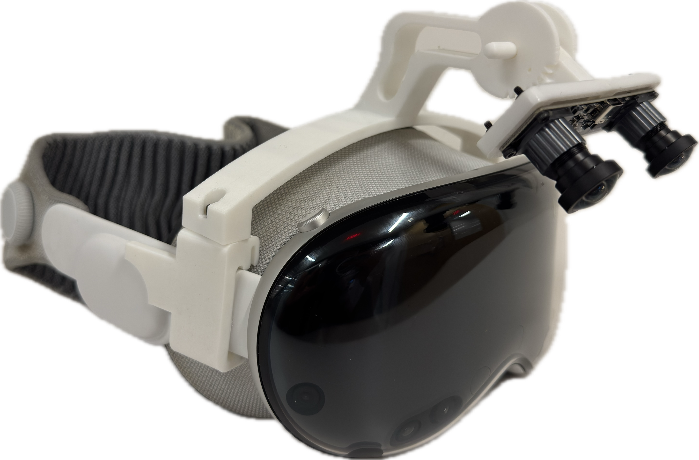

## Hardware Setup

### Materials
| ID | Part                                      | Description                              | Quantity |
|----|-------------------------------------------|-----------------------------------|----------|
| 1 | [Apple Vision Pro](https://www.apple.com/apple-vision-pro/) | Device for data collection | 1 |
| 2 | [Dual Lens USB Camera](https://www.amazon.com/dp/B0CBLZJZBT) | Main camera to collect egocentric videos | 1 |
| 3 | [Printed parts of the human camera mount](../hardware/camera_mounts/human_apple_vision_pro/print/) | 3D prints for the camera mount on the Apple Vision Pro | 1 |
| 4 | [RX-M3x5.7 threaded inserts](https://www.amazon.com/gp/product/B08BCRZZS3) | Inserts to connect different printed parts of the camera mount | 4 |
| 5 | [M3x12mm screws](https://www.amazon.com/gp/product/B0D3X5CT2J) | Screws to connect different printed parts of the camera mount | 2 |
| 6 | [M2x10mm screws and M2 nuts](https://www.amazon.com/gp/product/B0B93G1H9L) | Connect the stereo camera to the camera mount | 4 |

### Results

  

Apple Vision Pro with the dual-lens stereo camera.

